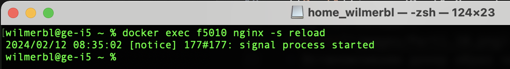
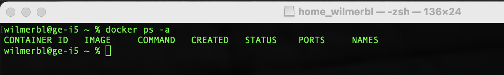

[Part 1. Готовый докер](#part-1-готовый-докер)\
[Part 2. Операции с контейнером](#part-2-операции-с-контейнером)\
[Part 3. Мини веб-сервер](#part-3-мини-веб-сервер)\
[Part 4. Свой докер](#part-4-свой-докер)\
[Part 5. Dockle](#part-5-dockle)\
[Part 6. Базовый Docker Compose](#part-6-базовый-docker-compose)
## Part 1. Готовый докер
- Скачиваем докер-образ :whale: nginx с докер-хаба командой ***docker pull nginx***:\

- Проверяем наличие докер-образа :whale: через команду ***docker images***:\

- Запускаем докер-образ :whale: через команду ***docker run -d [image_id|repository]***(ввод полного id необязателен достаточно вести первые несколько символов):\

- Проверяю, что образ запустился через ***docker ps***:\

- Смотрю информацию о контейнере через ***docker inspect [container_id|container_name]***:\

- Размер контейнера:\

- Список замапленных портов:\

- ip контейнера:\

- Останавливаем докер образ через ***docker stop [container_id|container_name]*** :grin: :\

- Проверяем остановку докер образа командой ***docker ps*** :joy: :\

- Запускаем докер с портами 80 и 443 в контейнере, замапленными на такие же порты на локальной машине, через команду ***docker run -p 80:80 -p 443:443 nginx***:

- Проверяем, что в браузере по адресу localhost:80 доступна стартовая страница nginx:

- Перезапускаем докер контейнер через ***docker restart [container_id|container_name]***:

- Проверяю, что образ запустился через ***docker ps***:\

## Part 2. Операции с контейнером
- Читаем конфигурационный файл nginx.conf внутри докер контейнера через команду ***docker exec id cat /etc/nginx/nginx.conf***:

- Создаем на локальной машине файл ***vim nginx.conf***(взял файл nginx.conf с контейнера):

- Настриваем в нем по пути /status отдачу страницы статуса сервера nginx:\

- Копируем созданный файл nginx.conf внутрь докер-образа через команду ***docker cp***:

- Перезапускаем nginx внутри докер-образа через команду exec:

- Проверяем, что по адресу localhost:80/status отдается страничка со статусом сервера nginx:

- Экспортируем контейнер в файл container.tar через команду ***docker export id > container.tar***:

- Останавливаем контейнер:\

- Удаляем образ через ***docker rmi [image_id|repository]***, не удаляя перед этим контейнеры:

- Удаляю остановленный контейнер:\

- Импортирую контейнер обратно через команду ***docker import -c 'CMD ["nginx", "-g", "daemon off;"]' container.tar nginx_import***:

- Запускаем импортированный контейнер ***docker run -d -p 80:80 -p 443:443 nginx_import***:

- Проверяем, что по адресу localhost:80/status отдается страничка со статусом сервера nginx:

- Содержимое nginx.conf:

## Part 3. Мини веб-сервер
- Скачиваю образ nginx:

- Запускаем образ с прослушкой 81 порта:

- Копируем nginx.conf в /etc/nginx

- Переходим в контейнер ***docker exec -it 6039 bash***:\

- Обновляем репозиторий:

- Устанавливаем gcc:\

- Устанавливаем spawn-fcgi:

- Устанавливаем libfcgi:

- Копируем наш файл miniserver.c в контейнер:

- Компилируем наш файл miniserver.c:

- Запускаем написанный мини-сервер через spawn-fcgi на порту 8080 и перезапускаем nginx:

- Проверяем, что в браузере по localhost:81 отдается запись Hello World!:\

## Part 4. Свой докер
- Создаю докер образ на основе nginx. Cобираю исходники мини сервера на FastCgi из Части 3 и помещаю их в папку /home. Помещаю скрипт run.sh в папку /home.
- Устанавливаю нужные утилиты для запуска минисервера.
- Командой ENTRYPOINT(этой командой я указываю на первую команду которая будет выполнятся при запуске контейнера) запускаю скрипт run.sh. Данный скрипт запускает минисервер на 8080 порту и запускает nginx также запускает утилиту tail которая предотвратит закрытие контейнера после запуска.
- Содержимое полученного докерфайла:

- Собираем образ командой ***docker build -t part4*** :hammer: :

- Проверяем через ***docker images***, что все собралось корректно:

- Запускаем собранный докер-образ с маппингом 81 порта на 80 на локальной машине и маппингом папки ./nginx внутрь контейнера по адресу, где лежат конфигурационные файлы nginx'а :hammer: :

- Проверяем, что по localhost:80 доступна страничка написанного мини сервера :ok_hand: :

- Дописываем :black_nib: в ./nginx/nginx.conf(нужно установить vim) проксирование странички /status, по которой надо отдавать статус сервера nginx:\

- Перезапускаем докер-образ:\

- Теперь проверяем, что по localhost:80/status отдается страничка со статусом nginx :ok_hand: :

- Содержимое run.sh:\

## Part 5. Dockle
- Устанавливаем ***brew install goodwithtech/r/dockle***:

- Сканируем образ из предыдущего задания через ***dockle [image_id|repository]***:

- Чтобы исправить WARN - DKL-DI-0006 нужно при билдинге образа добавить версию образа ***docker build -t tag part4:1***
- Чтобы исправить WARN - DKL-DI-0003 нужно в докерфайле заменить apt-get на apt
- Чтобы исправить WARN - CIS-DI-0001 нужно в докерфайле добавить пользователя для контейнера(последний пользователь не должен быть рутом)
- Чтобы исправить FATAL	- DKL-DI-0005 нужно в докерфайле добавить команду для очистки кэша
- Чтобы исправить FATAL	- CIS-DI-0010 нужно проверять образ с флагами которые будут игнорировать NGINX_GPGKEY и NGINX_GPGKEY_PATH ***dockle -ak NGINX_GPGKEY -ak NGINX_GPGKEY_PATH part4:1***
- Ошибок и предупреждений нету:

- Исправленный докерфайл:

## Part 6. Базовый Docker Compose
- Написал docker-compose.
- Здесь поднимается докер-контейнер из Части 5\

- Здесь поднимается  докер-контейнер с nginx. Там же замапливаю порты 8080 порт контейнера на 80 порт локальной машины

- Добовляю настройку в nginx.conf для того чтобы проксировать все запросы с 8080 порта на 81 порт первого контейнера:

- Остановил все запущенные контейнеры:

- Собираю и запускаю проект с помощью команд ***docker-compose build*** и ***docker-compose up***:

- По localhost:80 отдается написанная мной страничка, как и ранее:
